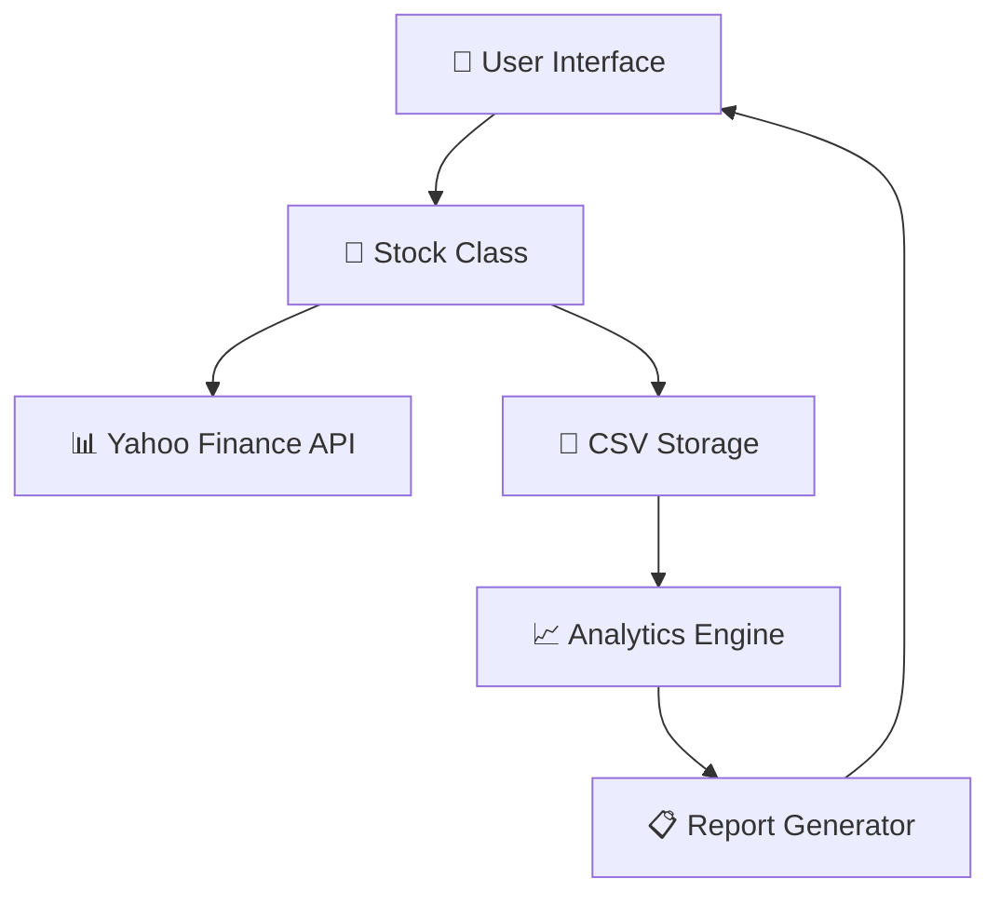

<div align="center">

# 📈 Stock Portfolio Management System

*A beautiful, comprehensive Python-based portfolio tracking and analysis tool*


---

### *"Transform your investment tracking from chaos to clarity"*

[](https://github.com/yourusername/portfolio-manager)
[](https://twitter.com/yourusername)

</div>

---

## 🎯 **What Makes This Special?**

<table>
<tr>
<td width="33%" align="center">

<h3>💰 Real-Time Tracking</h3>
<p>Live stock prices and automatic dividend calculations powered by Yahoo Finance</p>
</td>
<td width="33%" align="center">

<h3>📊 Advanced Analytics</h3>
<p>CAGR, VaR, volatility analysis, and professional-grade risk metrics</p>
</td>
<td width="33%" align="center">

<h3>✨ Beautiful Interface</h3>
<p>Clean, intuitive command-line interface with formatted reports</p>
</td>
</tr>
</table>

---

## 🚀 **Quick Start**

### 📋 **Prerequisites**

```bash
# Install required packages
pip install numpy yfinance
```

### ⚡ **One-Minute Setup**

```bash
# 1. Download the script
curl -O https://raw.githubusercontent.com/yourusername/portfolio-manager/main/portfolio_manager.py

# 2. Run it!
python portfolio_manager.py

# 3. Start tracking your investments! 🎉
```

---

## 🎨 **Feature Gallery**

<details>
<summary>📊 <b>Portfolio Dashboard</b> - Click to expand</summary>

```
================================================================================
                          COMPREHENSIVE PORTFOLIO ANALYSIS
================================================================================

PROFIT & LOSS STATEMENT
================================================================================
Stock    Qty    Buy Price  Current    Invested     Current Val  Dividends  P/L      P/L %
--------------------------------------------------------------------------------
AAPL     10     $150.25    $175.30    $1,502.50    $1,753.00    $12.50     $263.00  17.5%
MSFT     5      $280.10    $295.45    $1,400.50    $1,477.25    $8.75      $85.50   6.1%
GOOGL    3      $2,100.00  $2,250.75  $6,300.00    $6,752.25    $0.00      $452.25  7.2%
TSLA     8      $245.80    $267.20    $1,966.40    $2,137.60    $5.20      $176.40  9.0%
--------------------------------------------------------------------------------
TOTAL                                 $11,169.40   $12,120.10   $26.45     $977.15  8.7%
================================================================================

PORTFOLIO METRICS:
──────────────────────────────────────
📈 Total Portfolio Return:     8.70%
🎯 Portfolio CAGR:            12.45%
⚖️  Weighted Portfolio Return: 8.70%
📊 Portfolio Volatility:      18.32%
⚠️  Value at Risk (5%):       -2.45% ($-296.89)
```

</details>

<details>
<summary>🎛️ <b>Interactive Menu</b> - Click to expand</summary>

```
==================================================
        STOCK PORTFOLIO MANAGEMENT SYSTEM
==================================================
🔵 1.  Buy stock (current date)
🔵 2.  Buy stock (specific date)
🔴 3.  Sell stock
📊 4.  Check total returns of a stock
📈 5.  Check total returns of portfolio
📉 6.  Check CAGR of full portfolio
⚖️  7.  Check Weighted Portfolio Return
📊 8.  Check Standard Deviation (Volatility)
⚠️  9.  Check Value at Risk (VaR)
💰 10. Show P/L overall
🌟 11. Show everything
🚪 12. Exit
==================================================
```

</details>

---

## 🛠️ **Core Features**

<div align="center">

| Feature | Description | Status |
|---------|-------------|--------|
| 🔄 **Real-Time Data** | Live stock prices via Yahoo Finance API | ✅ Active |
| 💰 **Buy/Sell Tracking** | Record transactions with dates and prices | ✅ Active |
| 📊 **Performance Analytics** | CAGR, returns, volatility calculations | ✅ Active |
| 🎯 **Risk Management** | VaR analysis and portfolio volatility | ✅ Active |
| 💸 **Dividend Tracking** | Automatic dividend calculation and inclusion | ✅ Active |
| 📈 **Profit & Loss** | Detailed P&L statements with formatting | ✅ Active |
| 📋 **Data Persistence** | CSV-based portfolio storage | ✅ Active |
| 🔒 **Error Handling** | Robust input validation and error management | ✅ Active |

</div>

---

## 🎭 **Usage Examples**

### 💎 **Adding Your First Stock**

```python
# Choose option 1 from menu
Enter the symbol: AAPL
How many stocks: 10
Buy price or increase: 0.03

✅ Added 10 shares of AAPL at $175.33
```

### 📊 **Checking Performance**

```python
# Choose option 11 for complete analysis
🎉 Generating comprehensive portfolio report...

📈 Your portfolio is up 8.7% overall!
💰 Total profit: $977.15
⏱️  CAGR: 12.45% annually
```

### 🔄 **Recording a Sale**

```python
# Choose option 3
Enter stock to sell: TSLA

✅ Selling TSLA at current price $267.20
📅 Sale recorded for today's date
```

---

## 🏗️ **Architecture Overview**

<div align="center">



</div>

### 🗃️ **Data Structure**

```python
# CSV Schema
Portfolio Data (index.csv)
├── Stock Symbol     # AAPL, MSFT, GOOGL
├── Quantity        # Number of shares
├── Buy Price       # Purchase price per share
├── Buy Date        # YYYY-MM-DD format
├── Sell Date       # YYYY-MM-DD (if sold)
└── Sell Price      # Sale price (if sold)
```

---

## 🎯 **Advanced Analytics**

<div align="center">

### 📊 **Risk Metrics**

| Metric | Formula | Purpose |
|--------|---------|---------|
| **Volatility** | `σ = √(Σ(r-μ)²/n) × √252` | Portfolio risk measurement |
| **Value at Risk** | `VaR = μ - (z × σ)` | Potential loss estimation |
| **CAGR** | `(Ending/Beginning)^(1/years) - 1` | Annualized return rate |

</div>

---

## 🎨 **Customization Options**

<details>
<summary>🎛️ <b>Configuration Settings</b></summary>

```python
# Risk Parameters
CONFIDENCE_LEVEL = 0.05      # VaR confidence (95%)
TRADING_DAYS = 252           # Annual trading days
MIN_STOCK_PRICE = 0.6        # Minimum valid price
MAX_INCREASE_PCT = 0.2       # Maximum price adjustment

# Display Options
DECIMAL_PLACES = 2           # Price precision
TABLE_WIDTH = 80             # Report table width
CURRENCY_SYMBOL = "$"        # Currency display
```

</details>

---

## 🚨 **Important Information**

<div align="center">

### ⚠️ **Disclaimers**

| Category | Details |
|----------|---------|
| 🎓 **Educational Use** | This tool is for learning and personal tracking only |
| 📊 **Data Source** | Yahoo Finance API - requires internet connection |
| 💰 **Not Financial Advice** | Always consult professionals for investment decisions |
| 🔧 **Accuracy** | Prices are indicative and may have delays |

</div>

---

## 🤝 **Contributing**

<div align="center">

We welcome contributions! Here's how you can help:

[](https://github.com/Suyyash-aroraa/PortfolioAnalysisUsingPython/contributors)

</div>

### 🎯 **Contribution Areas**

- [ ] 🖥️ **GUI Development** - Tkinter or PyQt interface
- [ ] 📱 **Mobile App** - React Native or Flutter
- [ ] 🗄️ **Database Integration** - PostgreSQL or MongoDB
- [ ] 📊 **Advanced Metrics** - Sharpe ratio, Beta, Alpha
- [ ] 🌍 **Multi-Currency** - International market support
- [ ] 📈 **Charting** - Matplotlib or Plotly integration
- [ ] 📧 **Notifications** - Email alerts for price changes
- [ ] 🔐 **Security** - Encryption for sensitive data

---

## 📚 **Learning Outcomes**

<div align="center">

*Perfect for Python learners who want to build something practical!*

</div>

### 🎓 **Skills You'll Learn**

| Concept | Implementation | Level |
|---------|----------------|-------|
| 🐍 **OOP in Python** | Stock class design | Intermediate |
| 📊 **Financial Calculations** | CAGR, VaR, volatility | Advanced |
| 🔗 **API Integration** | Yahoo Finance connection | Intermediate |
| 📁 **File Handling** | CSV read/write operations | Beginner |
| ❌ **Error Handling** | Try-catch and validation | Intermediate |
| 🎨 **User Interface** | Menu-driven applications | Beginner |

---

## 🆘 **Support & FAQ**

<details>
<summary>❓ <b>Common Issues</b></summary>

**Q: Stock symbol not found**
```bash
A: Verify the ticker symbol (e.g., AAPL not Apple)
   Check if the stock is publicly traded
```

**Q: Network connection error**
```bash
A: Ensure internet connection is stable
   Yahoo Finance servers may be temporarily down
```

**Q: CSV file corrupted**
```bash
A: Delete index.csv - it will be recreated automatically
   Don't edit the CSV file manually
```

</details>

---

<div align="center">

## 🌟 **Show Your Support**

If this project helped you, please consider:

[]([https://github.com/yourusername/portfolio-manager](https://github.com/Suyyash-aroraa/PortfolioAnalysisUsingPython))

---

### 📄 **License**

This project is licensed under the MIT License - see the [LICENSE](LICENSE) file for details.

---

*Made with ❤️ by developers, for developers*

**🚀 Happy Investing!**

</div>
